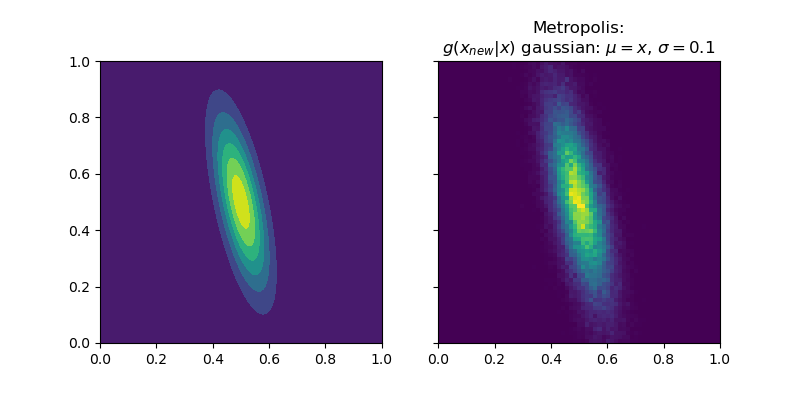

## Monte Carlo methods

Markov Chain Monte Carlo: Metropolis, Metropolis-Hastings, Glauber

* For 1D:

* For 2D normal distribution (Metropolis):

Importance sampling

* Importance sampling to estimate an expectation by using samples coming
from another distribution (proposal distribution $g(x)$) instead of sampling
from $f=\rho$. Note that importance sampling is not a sampling method.
The importance weights are used to correct the bias introduced by sampling from
the wrong distribution.

Sampling importance resampling

* Sampling importance resampling can be used to get samples approximately from
the distribution. The idea is to get samples from the proposal distribution,
obtain the importance weights of each of these samples $x_i$ as in
importance sampling and sampling from these samples with probabilities specified
by the normalized importance weights.

Ising model

* Ising model: not working as expected

