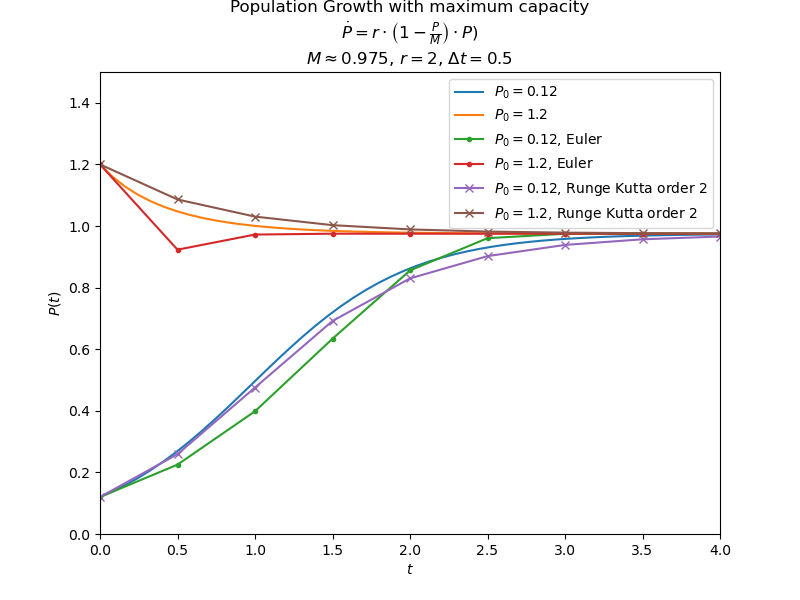

## Population Growth

* Without maximum capacity:

Continuous time dynamic system described by:

$$\dot{P}(t) = r \cdot P(t) = r_1 \cdot B(t) - r_2 \cdot D(t)$$

where $r = r_1 - r_2$

Analytical solution:

$$P(t) = P(0) \cdot e^{r \cdot t}$$

So if $r > 0$, we have an exponential growth of the population. There's an unstable/repulsive
fixed point for P=0.

* With maximum capacity $M$:

Continuous time dynamic system described by:

$$\dot{P}(t) = r \cdot \left(1 - \frac{P(t)}{M}\right) \cdot P(t)$$

where $M$ is the carrying capacity (maximum population of an organism that
the environment can sustain indefinitely).

Analytical solution:

$$P(t) = \frac{M}{1 + \frac{M-P(0)}{P(0)} \cdot e^{-r \cdot t}}$$

If $P(0) > M$, the population decreases and if $P(0) < M$, the population increases.
For $P(t) \approx 0$, the population increases exponentially like the simple model.
However, as $P(t)$ increases, the growth rate is reduced.
